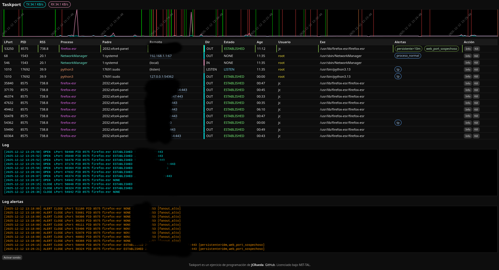

# Taskport

Taskport es una herramienta **local**, **autónoma** y **visual** de **inspección en tiempo real de puertos, procesos y conexiones de red**, orientada a **detección temprana de comportamientos anómalos** en sistemas Linux de escritorio o servidor. No es un IDS ni un firewall, es un visor cognitivo que muestra el estado de la red por proceso y conexión, con reglas personalizables. 

Taskport se despliega como un servicio web local. Se ejecuta con `python3 taskport.py` y se accede mediante navegador web en la URL `http://localhost:1010.



## Qué hace Taskport

Enumera **todas las conexiones TCP/UDP activas** del sistema y asocia cada conexión a su **PID, proceso, usuario, binario y proceso padre**.
Distingue **LISTEN / IN / OUT / ESTABLISHED**, calcula **fan-out**, edad de conexión y exposición real.
Aplica un **motor de reglas declarativo** (JSON) para generar alertas, manteniendo un **log cronológico** de todos los eventos y otro de únicamente aquellos que disparan alertas. 
Muestra los eventos de red sobre una **gráfica temporal TX/RX**. Permite **matar procesos** desde la interfaz. Todo ocurre **en local**, sin agentes externos ni envío de datos.

---

## Filosofía

Taskport no intenta “decidir por ti”.  Te da **contexto técnico inmediato** para que decidas.  

---

## Arquitectura

- **Backend**: Python + Flask + psutil  
- **Frontend**: HTML embebido + JS puro + Canvas  
- **Estado**: memoria local + log circular  
- **Reglas**: `rules.json` (fuente única de verdad)

Archivo principal: `taskport.py` 
Definición de reglas: `rules.json`

---

## Motor de reglas

Las reglas se definen en JSON mediante expresiones lógicas (`all`, `any`, `not`) sobre un **contexto enriquecido** por conexión:

Campos disponibles (ejemplos):

- `pid`, `name`, `user`
- `exe_path`, `exe_standard`, `exe_missing`
- `port`, `rport`, `rip`, `ip_publica`
- `status`, `dir`
- `fanout`, `age_s`
- `alerts` (reglas ya disparadas)

Las reglas pueden **encadenarse** (fixpoint), permitiendo detectar patrones complejos.

Ejemplos incluidos:
- Escritorio remoto activo
- Root con salida de red no reconocida
- Web falsa escuchando en 80/443
- Beaconing
- LISTEN en puertos efímeros
- Conexiones persistentes sospechosas

Cada alerta incluye campos descriptivos que ayudan al usuario a determinar si la conexión es sospechosa o un falso positivo:
- **Por qué**
- **Falsos positivos típicos**
- **Qué mirar primero**

Todo visible en la UI.

---

## Interfaz

- Tabla de puertos ordenada por **severidad**
- Colores por proceso (persistentes)
- Badges clicables con explicación
- Log normal + log de alertas
- Gráfica TX/RX de los últimos minutos
- Marcas verticales de OPEN / CLOSE
- Tooltip temporal con TX/RX + eventos
- Sonido opcional al abrir puerto
- Modal de información detallada del PID
- Posibilidad de determinar lugar geográfico e información de IP remota

No requiere navegador externo ni dependencias gráficas.

---

## Instalación

Requisitos:
- Linux
- Python 3.8+
- Permisos para inspeccionar procesos

```bash
pip install flask psutil
